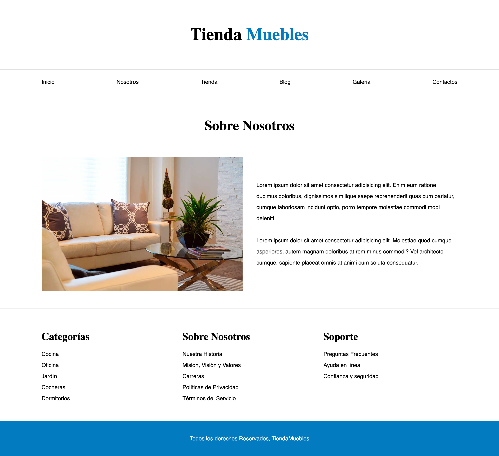
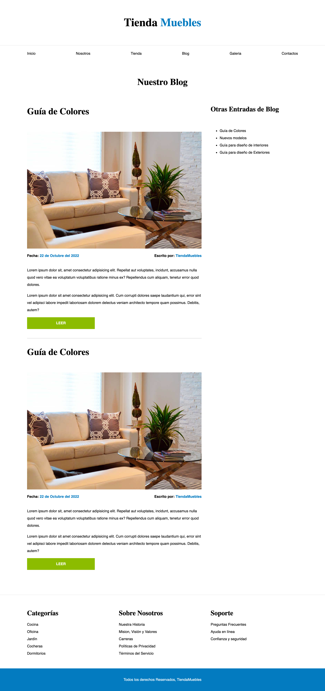
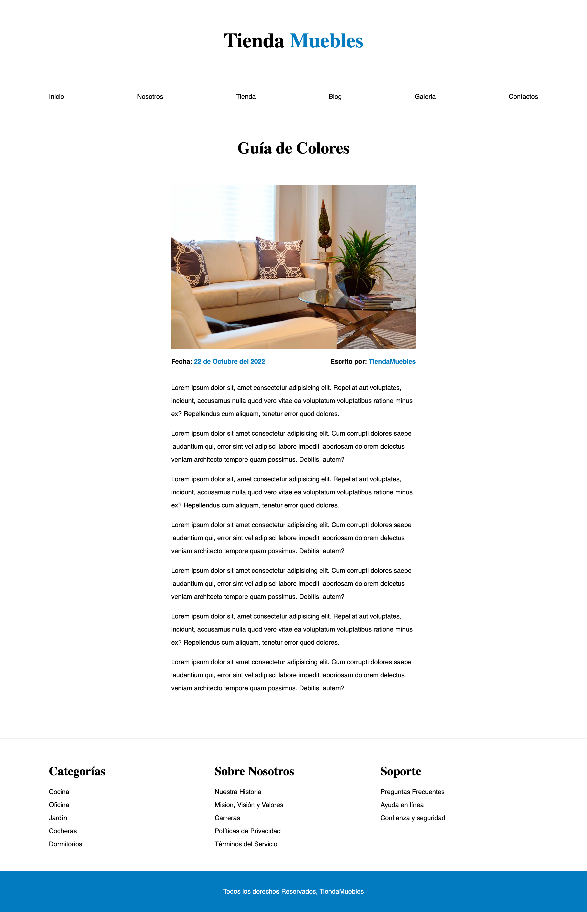
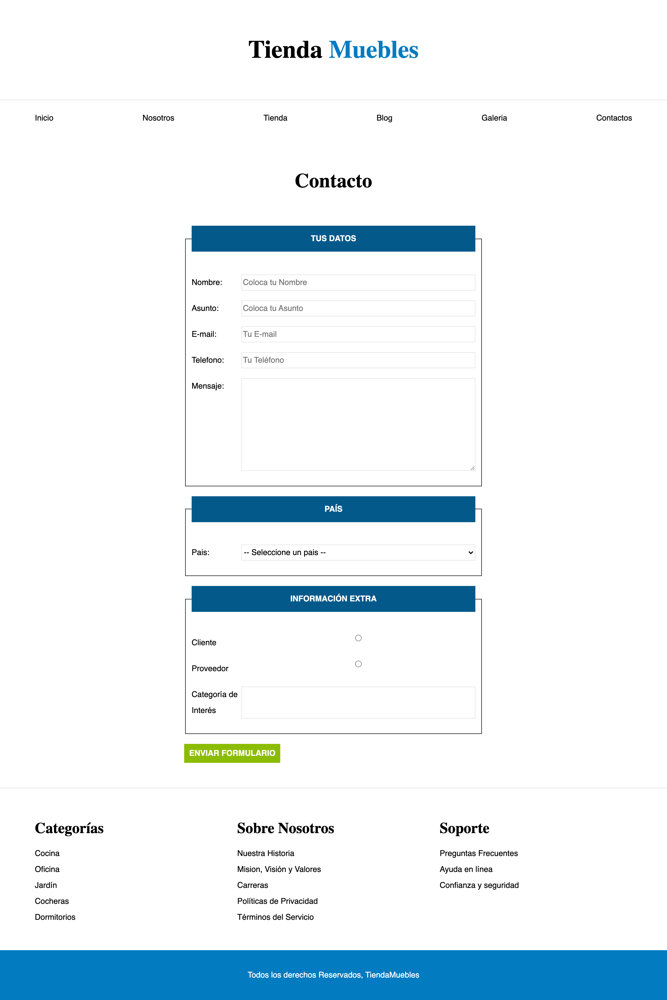

# Tienda de Muebles

Este proyecto es una website de una Ecommerce sobre una tienda de muebles en donde seguí el paso a paso del curso de [Juan Pablo de la Torre Valdez](https://www.udemy.com/course/css-grid-y-flexbox-la-guia-definitiva-crea-10-proyectos/) - "CSS La Guía Completa - Flexbox, CSS Grid, SASS +20 proyectos"

Este es el primer proyecto de una guía de varios proyectos.

Estas son las capturas de pantalla del proyecto completo

## Home
---

## Nosotros
---

## Tienda
---

## Blog
---

## Entrada
---

## Galeria
---

## Contacto
---

